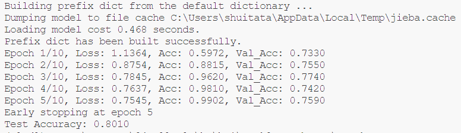
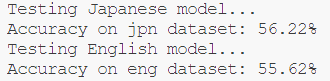

# Task 1 Report

我的全部代码在https://github.com/shuitatata/24Fall-NLPDL中

## `flatten_list`
函数 `flatten_list` 接受一个嵌套列表并返回一个扁平化的列表。

一个简单的实现方式是使用**递归**遍历嵌套列表中的所有元素，并将它们添加到一个扁平化的列表中。实现如下：

```python
def flatten_list(nested_list: list):
    flat_list = []
    for item in nested_list:
        if isinstance(item, list):
            flat_list.extend(flatten_list(item))
        else:
            flat_list.append(item)
    return flat_list
```

另一种有趣的方法是使用**字符串方法**，将列表转换为字符串，去掉括号，然后通过分割字符串来获得扁平化的列表。实现如下：
```python
def flatten_list(nested_list: list):
    nested_str = str(nested_list)
    flattened_str = nested_str.replace('[', '').replace(']', '')
    flat_list = [int(x) for x in flattened_str.split(',') if x.strip()]
    return flat_list
```

这两种实现方式在不同规模数据上的性能表现如下表所示：

| Methods | $10^3$ | $10^4$ | $10^5$ | $10^6$ | $10^7$ |
|---------|--------|--------|--------|--------|--------|
| Recursion | 0.0000s | 0.0014s | 0.01951s | 0.2227s | 2.2643s |
| String Methods | 0.0000s | 0.0040s | 0.0290s | 0.3867s | 3.9976s |


## `char_count`

函数 `char_count` 接受一个字符串并返回一个字典，字典中包含该字符串中每个字符的出现次数。

`char_count()` 的实现非常简单；Python 中的**内置函数** `str.count()` 可以轻松获取结果。实现如下：

```python
def char_count(string: str):
    return {char: s.count(char) for char in set(s)}
```

当然，我们也可以使用更**传统的方法**来统计字符串中的字符，时间复杂度为 $O(n)$。实现如下：
```python
def char_count(string: str):
    char_dict = {}
    for char in string:
        if char in char_dict:
            char_dict[char] += 1
        else:
            char_dict[char] = 1
    return char_dict
```

这两种实现方式在不同规模数据上的性能表现如下表所示：

| Methods | $10^3$ | $10^4$ | $10^5$ | $10^6$ | $10^7$ |
|---------|--------|--------|--------|--------|--------|
|built-in| 0.0000s| 0.0000s| 0.0025s| 0.0210s| 0.2049s|
|traditional| 0.0000s| 0.0009s| 0.061s| 0.0594s| 0.6135s|

# Task 2

## 词典构建
使用`jieba`分词，将训练集中的文本进行分词，并整理为词典。
经测试，训练集中85%的词在该词典中，其余的词用\<unk>表示。

## 模型结构
按照论文中的描述，我构建了一个卷积神经网络。这个网络的输入是token的序列，首先进行embedding，然后同时进行多次卷积与池化操作，将结果拼接在一起，最后通过全连接层和softmax归一化输出分类的结果。
## 模型参数
词向量维度为256。
卷积核的大小分别为2、3、4、5，每个卷积核输出的通道数为128。
drupout概率为0.4，学习率为0.001，batch size为16。
模型训练了5个epoch
## 模型效果
在训练集上的准确率达到了99.0%，在验证集上的准确率是75.9%，在测试集上的准确率达到80.1%。



# Task 3

## Word Embedding

我采用了**连续词袋模型（Continuous Bag of Words, CBOW）**来训练日语和英语的词嵌入。CBOW模型通过使用上下文词预测目标词，学习词语的语义表示。模型的核心是一个嵌入层，它将输入的上下文词语转换为向量表示，并通过对这些向量求平均来捕捉整体语义。模型随后通过一个线性层将该向量映射到词汇表中，用于预测目标词。

### 数据预处理与词汇表构建

为了进行词嵌入训练，首先对日语和英语句子进行了处理：

- 使用`MeCab`分词器处理日语，并对每个句子添加特殊符号`<sos>`（句子开头）和`<eos>`（句子结束）。

- 对英文句子，使用`nltk`工具进行分词，并同样添加`<sos>`和`<eos>`。
- 日语部分的上下文词被限定为3个，英语部分为2个

### 训练

在训练中，我随机将数据集划分为训练集、验证集和测试集（比例为8:1:1）。训练过程使用了Adam优化器，损失函数为交叉熵损失。在每个epoch结束时，模型在验证集上进行评估，以确定模型的性能，并基于验证集的准确度实现early stopping机制。

### 模型性能

最终通过预测的准确率对词嵌入模型进行评估



## LSTM with Attention Model

在本次机器翻译任务中，我实现了一个基于**LSTM**的序列到序列（Seq2Seq）模型，并结合了**点积注意力机制**（Dot Product Attention）来增强翻译的效果。以下是模型的详细结构介绍。

### 模型结构

#### 编码器

编码器的主要功能是将输入的源语言序列编码为隐藏状态（hidden states）和细胞状态（cell states），这些状态将作为解码器的初始输入。模型结构如下：

- **Embedding Layer**：编码器首先将词ID序列转换为稠密的词嵌入向量。如果有预训练的词嵌入，则会使用预训练的权重。
- **LSTM Layer**：使用双向LSTM处理输入的嵌入向量，双向LSTM可以更好地捕捉句子的前后语义。LSTM会返回所有时间步的输出，以及最后一步的隐藏状态和细胞状态，供解码器使用。

#### Attention

在本任务中，我使用了**点积注意力**（Dot Product Attention）来计算解码器中每个时间步的上下文向量。具体步骤如下：

- **计算注意力分数**：将解码器当前时间步的隐藏状态与编码器的所有隐藏状态通过点积计算得到注意力权重（attention weights），表示源语言中每个单词对当前翻译的贡献。注意，由于Encoder采用了双向LSTM，因此在进行点积运算时，需要将Decoder的隐藏状态复制一份再拼接起来。
- **归一化注意力权重**：使用Softmax函数对注意力权重进行归一化，确保权重的总和为1。
- **计算上下文向量**：对编码器的输出加权求和，得到上下文向量，该向量提供解码器生成目标词所需的额外信息。

#### 解码器

解码器的主要任务是将编码器生成的隐藏状态和上下文向量解码为目标语言序列。模型结构如下：

- **Embedding Layer**：将输入的目标语言词ID转换为嵌入向量。
- **LSTM Layer**：将前一个时间步的**嵌入向量**和**上下文向量**拼接后传入LSTM，并结合上一时间步的隐藏状态和细胞状态，生成当前时间步的输出。
- **Attention Mechanism**：在解码器每个时间步中，都会使用注意力机制计算上下文向量，以帮助解码当前词。
- **Fully Connected Layer**：解码器的最终输出通过全连接层转换为目标词汇表中的词语分布。

#### 完整模型

整个模型由编码器、解码器和注意力机制组成，具体计算流程如下：

**编码过程**：将源语言序列输入编码器，得到编码器的输出和隐藏状态。

**解码过程**：每个时间步，解码器接收上一步的输出（或目标序列的实际值），结合注意力机制计算的**上下文向量**，生成当前时间步的预测结果。

**Teacher Forcing**：训练过程中使用Teacher Forcing技术，即以一定概率使用目标序列的真实值作为解码器的输入，以加速模型收敛。

### 模型参数

通过对参数进行广泛的实验，最终确定参数如下：

- 词向量维度/嵌入层维度：256
- 隐藏层维度： 1024
- LSTM 层数：1层
- Adam 优化器，交叉熵损失函数，learning rate 0.001，batch size 128

### 模型评估

最终模型在测试集上的的BLEU得分为25.2826

采用
$$
Perplexity = 2^{-\sum_x p(x)log_2 pr(x)}
$$
的计算方法，计算得到困惑度为1.0013

### 样例

对题目中给出的五个样例，翻译的结果如下：

| **日语输入**           | **模型翻译结果**             | **翻译软件结果**             |
| ---------------------- | ---------------------------- | ---------------------------- |
| 私の名前は愛です       | What 's my name is love .    | My name is Love.             |
| 昨日はお肉を食べません | I don't eat meat yesterday . | I didn't eat meat yesterday. |
| いただきますよう       | I'll have everything .       | Thank you.                   |
| 秋は好きです           | I like autumn .              | I like autumn.               |
| おはようございます     | Good morning .               | Good morning.                |

#### 分析

对于简单句子，如I like autumn和Good morning，模型可以较准确的翻译出来。

而对于稍微复杂的句子，例如“私の名前は愛です”和“いただきますよう”，模型的表现并不理想。

值得注意的是，从"didn't"被误翻为"don't"来看，该模型并没有学会时态语态的相关信息。

### 总结

在此次实验中，我有以下几点发现。

对于nlp任务，分词的好坏是至关重要的。在最初，我对于英语的分词采用简单的按照空格来划分，没有特意取出标点，也无法将"I'll"这样的部分划分为"I"和"'ll"，导致模型的效果较差。

此外，在encoder中采用双向的架构，一般可以取得不错的效果。我将LSTM由单向改为双向后，模型的BLEU值有比较显著的提高。双向网络有助于从原始文本中提取更多的信息。

同时，我一开始对于Teacher Forcing的理解有误，在训练时使用了100%的Teacher Forcing。将该比例设为0.5后，我迎来了模型性能最大的一次提升。

最后，网络并不是越深越好，我将LSTM从多层改为单层后，效果反而有上升。
